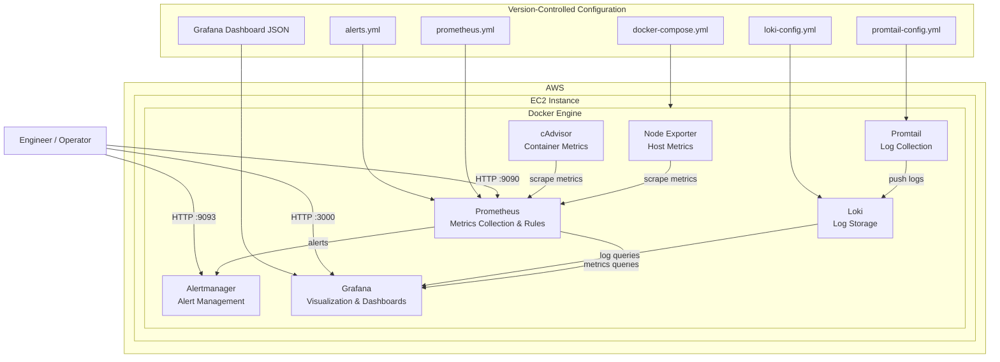

# SignalOps Developer Guide

## 1. Introduction

SignalOps is a production-oriented infrastructure observability platform designed to monitor compute resources, containers, system health, application infrastructure, and operational events.

The platform combines metrics collection, visualization, log aggregation, alerting, container monitoring, infrastructure provisioning, and continuous integration into a single operational stack.

The primary goal of SignalOps is to provide engineers with a centralized view of infrastructure health while keeping the implementation reproducible, maintainable, and suitable for deployment in a cloud environment.

This guide explains how SignalOps is structured, how the components communicate, how to deploy the platform, how to operate it, how to troubleshoot common problems, and how to extend the system.

---

# 2. Technology Stack

SignalOps uses the following technologies:

| Component | Technology | Purpose |
|---|---|---|
| Cloud infrastructure | AWS | Hosts the observability environment |
| Infrastructure as Code | Terraform | Provisions and manages AWS infrastructure |
| Container runtime | Docker | Runs observability services |
| Container orchestration | Docker Compose | Defines and manages the service stack |
| Metrics collection | Prometheus | Collects and stores time-series metrics |
| Host metrics | Node Exporter | Exposes Linux host metrics |
| Container metrics | cAdvisor | Exposes Docker container metrics |
| Visualization | Grafana | Provides dashboards and operational visibility |
| Log collection | Promtail | Collects and forwards logs |
| Log storage | Loki | Stores and queries logs |
| Alerting | Alertmanager | Handles and routes Prometheus alerts |
| Reverse proxy / test workload | Nginx | Provides a monitored web service |
| CI | GitHub Actions | Validates changes automatically |
| Source control | Git / GitHub | Stores and versions the project |

---

# 3. Repository Structure

The repository is organized around infrastructure configuration, observability services, automation, documentation, and deployment.

```text
signalops/
├── alertmanager/
│   └── alertmanager.yml
│
├── docs/
│   ├── architecture/
│   │   └── product-vision.md
│   ├── developer/
│   │   └── developer-guide.md
│   ├── runbooks/
│   └── screenshots/
│       ├── aws/
│       ├── github/
│       ├── grafana/
│       └── prometheus/
│
├── grafana/
│   └── provisioning/
│       ├── dashboards/
│       │   ├── dashboard.yml
│       │   └── signalops-infrastructure-dashboard.json
│       └── datasources/
│           └── prometheus.yml
│
├── loki/
│   └── loki-config.yml
│
├── prometheus/
│   ├── prometheus.yml
│   └── rules/
│       └── alerts.yml
│
├── promtail/
│   └── promtail-config.yml
│
├── terraform/
│   ├── compute.tf
│   ├── locals.tf
│   ├── main.tf
│   ├── network.tf
│   ├── outputs.tf
│   ├── provider.tf
│   ├── security.tf
│   ├── variables.tf
│   ├── terraform.tfvars.example
│   └── scripts/
│       └── user_data.sh
│
├── .github/
│   └── workflows/
│       └── signalops-ci.yml
│
├── DECISIONS.md
├── docker-compose.yml
├── LICENSE
└── README.md

The repository separates infrastructure configuration from application configuration.

This makes it possible to modify the AWS environment without changing the monitoring configuration and modify monitoring behaviour without changing the infrastructure provisioning code.


# 4. System Architecture

SignalOps uses a containerized observability architecture deployed on an AWS EC2 instance. The platform separates infrastructure metrics, container metrics, logs, visualization, and alert management into dedicated services.



### 4.1 Component Responsibilities

| Component | Responsibility |
|---|---|
| AWS EC2 | Provides the compute environment for the SignalOps platform. |
| Docker Engine | Runs and isolates the observability services as containers. |
| Node Exporter | Exposes Linux host metrics such as CPU, memory, disk, filesystem, and network statistics. |
| cAdvisor | Collects container-level resource and performance metrics. |
| Prometheus | Scrapes metrics, stores time-series data, evaluates alert rules, and provides the PromQL query interface. |
| Alertmanager | Receives alerts from Prometheus and manages alert grouping, routing, and notification behavior. |
| Promtail | Reads Docker container logs and forwards them to Loki. |
| Loki | Stores and indexes log streams for querying through Grafana. |
| Grafana | Provides dashboards and operational visualization for metrics and logs. |
| Docker Compose | Defines and orchestrates the SignalOps service stack. |
| Terraform | Defines and provisions the AWS infrastructure as code. |

### 4.2 Data Flow

The platform follows two primary observability paths.

**Metrics path:**

```text
EC2 Host
   │
   └── Node Exporter
          │
          ▼
      Prometheus
          │
          ├── Alert Rules
          │       │
          │       ▼
          │   Alertmanager
          │
          └── Grafana
```

Container metrics follow a similar path:

```text
Docker Containers
       │
       ▼
    cAdvisor
       │
       ▼
   Prometheus
       │
       ▼
    Grafana
```

**Logs path:**

```text
Docker Container Logs
          │
          ▼
       Promtail
          │
          ▼
         Loki
          │
          ▼
       Grafana
```

This separation allows SignalOps to treat metrics and logs as different telemetry types while providing a single operational interface through Grafana.

### 4.3 Network Communication

SignalOps services communicate through the Docker network:

```text
signalops
```

Services should communicate using their Docker Compose service names rather than container localhost addresses.

For example:

```text
prometheus → node-exporter:9100
prometheus → cadvisor:8080
promtail   → loki:3100
grafana    → prometheus:9090
grafana    → loki:3100
prometheus → alertmanager:9093
```

This is important because `localhost` inside a container refers to that container itself, not another service running on the Docker network.

### 4.4 External Access

The EC2 instance publishes the primary observability interfaces through mapped ports:

| Service | Port | Purpose |
|---|---:|---|
| Grafana | 3000 | Dashboard and visualization interface |
| Prometheus | 9090 | Metrics query and monitoring interface |
| Alertmanager | 9093 | Alert management interface |
| Node Exporter | 9100 | Host metrics endpoint |
| cAdvisor | 8081 | Container metrics interface |
| Loki | 3100 | Log aggregation API |

Access to these ports should be restricted through the AWS security group according to the deployment's security requirements.

The architecture has five major layers:

Infrastructure
Container runtime
Metrics collection
Logging and alerting
Visualization and operations

## 5. Infrastructure Layer

AWS provides the compute environment for SignalOps.

Terraform manages the infrastructure configuration.

The Terraform configuration is responsible for defining resources such as:

EC2 compute
Networking
Security groups
Provider configuration
Instance configuration
Outputs
Environment-specific configuration

The primary compute workload runs on an EC2 instance.

The infrastructure configuration is intentionally stored as code so that the environment can be reproduced rather than manually configured through the AWS console.

6. Terraform
6.1 Terraform Configuration

The Terraform directory contains the infrastructure definition.

Important files include:

File	Responsibility
provider.tf	Configures the AWS provider
variables.tf	Defines configurable input variables
locals.tf	Defines reusable local values
compute.tf	Defines compute resources
network.tf	Defines networking resources
security.tf	Defines security groups and access rules
outputs.tf	Exposes useful infrastructure outputs
main.tf	Provides shared Terraform configuration
scripts/user_data.sh	Bootstraps the EC2 environment
6.2 Terraform Initialization

From the Terraform directory:

cd terraform
terraform init

This downloads the required provider plugins and initializes the working directory.

6.3 Terraform Formatting

Before committing Terraform changes:

terraform fmt -recursive

This ensures consistent Terraform formatting.

6.4 Terraform Validation

Validate the configuration:

terraform validate

Terraform should report that the configuration is valid.

6.5 Terraform Plan

Review proposed infrastructure changes before applying them:

terraform plan

The plan should always be reviewed before executing infrastructure changes.

6.6 Terraform Apply

To provision or update the environment:

terraform apply

Terraform will display the proposed changes and request confirmation before modifying infrastructure.

For automated environments, the approval process should be handled through an appropriate CI/CD workflow rather than blindly applying changes from a developer workstation.

7. Terraform State

Terraform state is critical to infrastructure management.

The local Terraform state contains information about resources Terraform manages.

The following files should not be committed to the repository:

terraform.tfstate
terraform.tfstate.backup

The repository's Terraform ignore rules prevent local state and generated Terraform files from being committed.

For a larger production deployment, remote state storage should be introduced using an appropriate backend with state locking and controlled access.

8. EC2 Environment

After provisioning, the EC2 instance hosts the SignalOps container stack.

The deployment flow is:
AWS EC2
   |
   v
Docker Engine
   |
   v
Docker Compose
   |
   +--> Prometheus
   +--> Grafana
   +--> Node Exporter
   +--> cAdvisor
   +--> Loki
   +--> Promtail
   +--> Alertmanager
   +--> Nginx

   The instance provides the compute environment while Docker provides process isolation for the observability services.

9. Docker Compose

The main service definition is:

docker-compose.yml

Docker Compose defines how SignalOps services are created, configured, connected, and persisted.

Start the stack with:

docker compose up -d

Check the running services:

docker compose ps

View service logs:

docker compose logs

Follow logs for a specific service:

docker compose logs -f prometheus

Stop the stack:

docker compose down

Restart the stack:

docker compose restart
10. Prometheus

Prometheus is the central metrics collection and storage component.

It periodically scrapes metrics endpoints exposed by monitored services.

The primary configuration is:

prometheus/prometheus.yml

Prometheus monitors targets including:

Prometheus itself
Node Exporter
cAdvisor

The architecture uses service names rather than hard-coded container IP addresses.

For example:

node-exporter:9100

is preferred over directly referencing a container IP address.

This allows Docker networking to resolve services dynamically.

11. Prometheus Targets

Prometheus exposes a target health page where every configured scrape target can be inspected.

A healthy target should report:

UP

The SignalOps deployment should have healthy targets for:

prometheus
node-exporter
cadvisor

If a target reports:

DOWN

Prometheus is unable to successfully scrape the target.

The first troubleshooting step is to inspect the target error.

12. Prometheus Queries

PromQL is used to query collected metrics.

Example:

up

This returns the availability state of monitored targets.

A value of:

1

indicates that the target is reachable.

A value of:

0

indicates that the target is unavailable.

Host CPU metrics can be queried using Node Exporter metrics.

For example:

100 - (avg by (instance) (rate(node_cpu_seconds_total{mode="idle"}[5m])) * 100)

This calculates approximate CPU utilization by measuring the proportion of CPU time that is not idle.

13. Node Exporter

Node Exporter exposes operating system and hardware metrics from the Linux host.

It provides information such as:

CPU utilization
Memory usage
Disk usage
Filesystem usage
Network traffic
Network packets
System load
CPU cores
System uptime

Node Exporter exposes its metrics endpoint on:

:9100/metrics

Prometheus scrapes this endpoint.

The resulting metrics provide the host-level infrastructure visibility used by Grafana.

14. cAdvisor

cAdvisor provides container-level resource metrics.

It exposes information about Docker containers including:

CPU usage
Memory usage
Network activity
Container lifecycle information
Resource consumption

Prometheus scrapes cAdvisor so container metrics become available for PromQL queries and Grafana dashboards.

This creates two distinct monitoring perspectives:
Node Exporter
    |
    +--> Host infrastructure

cAdvisor
    |
    +--> Docker containers


Both are required because host-level metrics alone do not provide enough visibility into individual container workloads.

15. Grafana

Grafana provides the visualization layer for SignalOps.

The Grafana instance connects to Prometheus as its metrics data source.

The provisioned Prometheus data source is stored at:

grafana/provisioning/datasources/prometheus.yml

The project also stores the dashboard definition as code:
grafana/provisioning/dashboards/
├── dashboard.yml
└── signalops-infrastructure-dashboard.json

This is important because dashboards should not exist only inside a manually configured Grafana instance.

The dashboard JSON allows the dashboard configuration to be version-controlled and reproduced.

16. SignalOps Infrastructure Dashboard

The primary SignalOps dashboard provides infrastructure visibility through multiple panels.

The dashboard includes metrics such as:

CPU utilization
Memory usage
Disk usage
Network receive traffic
Network transmit traffic
Running containers
Container resource consumption
Prometheus target availability

The dashboard provides an operational overview rather than replacing the underlying monitoring systems.

Grafana visualizes the data.

Prometheus collects the data.

Node Exporter and cAdvisor expose the data.

17. Grafana Data Sources

The primary metrics data source is:

Prometheus

The Prometheus endpoint inside the Docker network is:

http://prometheus:9090

Loki provides the log data source:

http://loki:3100

Grafana therefore provides a unified interface for both metrics and logs.

18. Loki

Loki provides centralized log storage.

Unlike traditional systems that index every part of a log message, Loki focuses primarily on labels and stores the log content efficiently.

The Loki configuration is:

loki/loki-config.yml

Loki exposes its service internally on:

3100

Grafana can query Loki to investigate application and infrastructure logs.

19. Promtail

Promtail acts as the log collection agent.

Its primary configuration is:

promtail/promtail-config.yml

Promtail collects logs and forwards them to Loki.

The flow is:
Application / Container Logs
            |
            v
         Promtail
            |
            v
           Loki
            |
            v
         Grafana

         This separates log collection from log storage and visualization.

20. Alertmanager

Alertmanager handles alerts generated by Prometheus.

The configuration is:

alertmanager/alertmanager.yml

Prometheus evaluates alerting rules.

When a rule enters a firing state, Prometheus sends the alert to Alertmanager.

The architecture is:
Prometheus Rules
       |
       v
   Alert Fires
       |
       v
 Alertmanager

 Alertmanager is responsible for handling alert notifications and grouping behaviour.

21. Alert Rules

SignalOps stores Prometheus alert rules at:

prometheus/rules/alerts.yml

The project contains alerts for important infrastructure conditions, including:

Instance availability
High CPU usage
High memory usage
High disk usage
cAdvisor availability

These rules provide basic operational detection capabilities.

The alerting system can be expanded later with additional service-specific rules.

22. Understanding Alert States

Prometheus alert rules can exist in different states.

Inactive

The alert condition is not currently true.

Pending

The alert condition has become true but has not remained true long enough to satisfy the configured duration.

Firing

The alert condition has remained true for the required duration.

For example:

InstanceDown

should become active when a monitored target remains unavailable.

This behaviour prevents short-lived metric failures from immediately becoming operational incidents.

23. Nginx

Nginx provides a monitored workload within the environment.

It can be used to verify:

Container availability
Network connectivity
Log collection
Container metrics
Infrastructure monitoring

Nginx logs can also be collected through the Promtail and Loki pipeline.

This gives SignalOps a realistic workload to observe rather than monitoring only the observability components themselves.

24. Docker Networking

SignalOps services communicate over the Docker Compose network.

Service discovery is handled through Docker's internal DNS.

For example:
prometheus
grafana
node-exporter
cadvisor
loki
alertmanager

can resolve each other by service name.

This is more reliable than relying on dynamically assigned container IP addresses.

When troubleshooting connectivity, inspect the Docker network:

docker network ls

Then inspect the SignalOps network:

docker network inspect signalops_signalops
25. Persistent Storage

SignalOps uses Docker volumes for persistent application data.

Important volumes include:

signalops_prometheus-data
signalops_grafana-storage
signalops_loki-data
signalops_alertmanager-data

These volumes prevent service data from disappearing when containers are recreated.

For example, Grafana stores its internal database under:

/var/lib/grafana

The Grafana database contains application state such as dashboard and configuration information.

The Docker volume provides persistence for this data.

26. Container Operations

List running containers:

docker ps

List all containers:

docker ps -a

Inspect a container:

docker inspect <container-name>

View container logs:

docker logs <container-name>

Follow container logs:

docker logs -f <container-name>

Open a shell inside a container:

docker exec -it <container-name> sh

Restart a specific service:

docker restart <container-name>
27. Health Verification

After deploying SignalOps, verification should happen from the bottom of the stack upward.

Step 1: Verify containers
docker compose ps

Confirm that expected services are running.

Step 2: Verify Prometheus

Open the Prometheus interface and inspect:

Status → Target health

All expected targets should report:

UP
Step 3: Verify Grafana

Open Grafana and confirm that:

Grafana loads successfully
Prometheus is configured as a data source
The SignalOps dashboard loads
Panels contain current data
Step 4: Verify alerts

Open the Prometheus alert interface and confirm that the configured alert rules are loaded.

Step 5: Verify logs

Use Grafana Explore with Loki to confirm that logs are available.

28. Troubleshooting Prometheus
Target reports DOWN

Start by checking the target error in:

Status → Target health

Then inspect the relevant service:

docker compose ps
docker compose logs <service>

For Node Exporter:

docker compose logs node-exporter

For cAdvisor:

docker compose logs cadvisor

Confirm that the service is running and that the configured hostname and port match the Docker Compose service definition.

29. Troubleshooting Grafana

If Grafana opens but panels show:

No data

check the following:

Grafana data source exists.
Prometheus is reachable.
Prometheus has healthy scrape targets.
The dashboard uses the correct data source.
The selected time range contains data.

The first place to verify is the Grafana data source configuration.

The second is Prometheus target health.

If Prometheus has no collected data, Grafana cannot display it.

30. Troubleshooting Docker Compose

If services fail to start:

docker compose ps

Then inspect logs:

docker compose logs <service>

Validate the Compose configuration:

docker compose config

This is useful for detecting invalid YAML, incorrect environment variables, missing configuration values, and malformed service definitions.

31. Troubleshooting Loki

If Grafana cannot retrieve logs from Loki:

Check whether Loki is running:

docker compose ps loki

Inspect Loki logs:

docker compose logs loki

Check whether Promtail is running:

docker compose ps promtail

Inspect Promtail:

docker compose logs promtail

The expected flow is:

Promtail → Loki → Grafana

A failure at any point prevents logs from appearing in Grafana.

32. Troubleshooting Alerts

If an expected alert does not appear:

Confirm that the alert rule exists.
Confirm that Prometheus loaded the rule.
Check the rule expression.
Check the current metric value.
Check the configured evaluation duration.
Confirm that the target labels match the expression.

Prometheus provides visibility into rule state through its alert interface.

33. Git Workflow

SignalOps uses Git for source control.

Before making changes:

git status

Review changes:

git diff

Stage changes:

git add .

Create a commit:

git commit -m "describe the change"

Push to the main branch:

git push origin main

Commit messages should describe the change clearly.

Examples:

Add Prometheus alert rules
Fix Grafana dashboard provisioning
Update Terraform security configuration
Improve developer documentation
34. Continuous Integration

SignalOps uses GitHub Actions for CI.

The workflow is located at:

.github/workflows/signalops-ci.yml

The CI pipeline provides automated validation when changes are pushed to the repository.

The purpose of CI is to catch configuration and infrastructure problems before changes become part of the main project state.

The workflow should remain lightweight and deterministic.

Infrastructure deployment should remain separate from basic repository validation unless an explicit deployment pipeline is introduced later.

35. Dashboard as Code

The SignalOps Grafana dashboard is stored as JSON:

grafana/provisioning/dashboards/signalops-infrastructure-dashboard.json

This provides an important engineering advantage.

The dashboard is not dependent on one Grafana installation.

A developer can clone the repository, start the stack, and provision the dashboard again.

Dashboard configuration should therefore be modified through the version-controlled definition whenever possible.

If dashboard changes are made manually in Grafana, export the updated dashboard and update the repository copy.

36. Configuration Management

Configuration belongs in version-controlled files wherever possible.

Examples include:
prometheus/prometheus.yml
prometheus/rules/alerts.yml
grafana/provisioning/datasources/prometheus.yml
grafana/provisioning/dashboards/dashboard.yml
loki/loki-config.yml
promtail/promtail-config.yml
alertmanager/alertmanager.yml
docker-compose.yml

Secrets should never be committed to Git.

Do not store:

AWS access keys
Private keys
Passwords
API tokens
Credentials
Production secrets

in the repository.

37. Security Considerations

SignalOps runs infrastructure monitoring services, so network exposure must be controlled carefully.

Only required services should be publicly accessible.

Internal services should communicate through the private Docker network whenever possible.

Node Exporter, cAdvisor, Prometheus, Loki, and Alertmanager do not need to be publicly exposed simply because they provide operational interfaces.

The EC2 security group should follow the principle of least privilege.

The project should avoid exposing monitoring endpoints directly to the public internet unless there is a specific operational requirement.

38. Deployment Workflow

A typical deployment follows this sequence:

1. Developer changes configuration
              |
              v
2. Git commit
              |
              v
3. GitHub Actions validation
              |
              v
4. Terraform provisions infrastructure
              |
              v
5. EC2 environment starts
              |
              v
6. Docker Compose starts services
              |
              v
7. Prometheus discovers targets
              |
              v
8. Metrics become available
              |
              v
9. Grafana visualizes metrics
              |
              v
10. Alert rules evaluate infrastructure

This workflow keeps infrastructure provisioning, service deployment, monitoring, and visualization connected while maintaining clear separation of responsibilities.

39. Reproducing the Environment

A developer starting from a clean environment should follow these high-level steps:
Clone repository
       |
       v
Configure AWS credentials
       |
       v
Review Terraform variables
       |
       v
Run terraform init
       |
       v
Run terraform validate
       |
       v
Run terraform plan
       |
       v
Provision infrastructure
       |
       v
Connect to EC2
       |
       v
Clone or deploy SignalOps
       |
       v
Start Docker Compose
       |
       v
Verify Prometheus
       |
       v
Verify Grafana
       |
       v
Verify alerts
       |
       v
Verify logs

The exact deployment process should always be reviewed against the current Terraform and Docker Compose configuration before execution.

40. Extending SignalOps

SignalOps is designed to support additional monitoring capabilities.

Possible future extensions include:

Alert routing integrations
Additional exporters
Application metrics
AWS service metrics
SLO and SLA monitoring
Synthetic monitoring
Distributed tracing
OpenTelemetry
Centralized authentication
Remote Prometheus storage
High availability
Multi-instance monitoring
Kubernetes monitoring
Cost and FinOps integration

New functionality should follow the existing architecture rather than introducing unnecessary coupling between services.

41. Adding a New Prometheus Target

To monitor another service:

Ensure the service exposes Prometheus-compatible metrics.
Add the service to the Docker network.
Add the target to prometheus/prometheus.yml.
Validate the Prometheus configuration.
Restart or reload Prometheus.
Verify the target in Prometheus.
Add Grafana panels if required.
Add alert rules if the service requires operational monitoring.

The target should use a stable service name and port.

42. Adding a New Alert

To add an alert:

Define the PromQL expression.
Determine the threshold.
Determine how long the condition must remain true.
Add the rule to:
prometheus/rules/alerts.yml
Validate the configuration.
Restart or reload Prometheus.
Confirm the rule appears in Prometheus.
Test the condition where practical.
Confirm Alertmanager receives the alert.

Alerts should represent actionable conditions.

Avoid creating alerts for normal fluctuations that do not require human intervention.

43. Adding a Grafana Panel

A new dashboard panel should follow this process:

Identify the metric.
Write and test the PromQL query in Prometheus.
Create the panel in Grafana.
Select the correct Prometheus data source.
Configure an appropriate visualization.
Verify that the panel displays real data.
Export the updated dashboard JSON.
Replace the version-controlled dashboard definition.
Commit the change.

The query should be tested independently before being incorporated into the dashboard.

44. Operational Philosophy

SignalOps follows several engineering principles.

Reproducibility

Infrastructure and monitoring configuration should be represented as code.

Observability

The system should expose enough information to understand its own behaviour.

Separation of concerns

Each component should perform a clearly defined responsibility.

Least privilege

Infrastructure access should be restricted to what is required.

Automation

Repeatable operations should be automated rather than manually repeated.

Version control

Configuration changes should be reviewable and traceable through Git.

Maintainability

The platform should remain understandable to another engineer without requiring undocumented knowledge.

45. Production Considerations

The current implementation demonstrates a production-oriented observability architecture, but additional controls would be appropriate before operating it as a critical enterprise monitoring platform.

Potential improvements include:

Remote Terraform state
Terraform state locking
Secret management
TLS termination
Authentication and authorization
Private networking
Highly available Prometheus
Remote metric storage
Loki object storage
Alert notification integrations
Backup and disaster recovery
Centralized audit logging
Infrastructure cost monitoring
Automated deployment
Security scanning
Container image scanning
Dependency management
Infrastructure drift detection

These improvements represent the next maturity level rather than requirements for the current project.

46. Development Checklist

Before considering a change complete:
[ ] Configuration is version-controlled
[ ] No secrets are committed
[ ] Terraform is formatted
[ ] Terraform validates successfully
[ ] Docker Compose configuration is valid
[ ] Containers start successfully
[ ] Prometheus targets are healthy
[ ] Grafana receives data
[ ] Alerts load successfully
[ ] Logs are available where expected
[ ] Dashboard changes are exported
[ ] GitHub Actions passes
[ ] Documentation is updated

47. Final Verification

A complete SignalOps environment should provide the following:

Infrastructure
AWS EC2 environment
Terraform-managed infrastructure
Controlled network access
Metrics
Prometheus
Node Exporter
cAdvisor
Visualization
Grafana
SignalOps infrastructure dashboard
Logging
Promtail
Loki
Grafana log exploration
Alerting
Prometheus alert rules
Alertmanager
Workload
Nginx
Automation
Docker Compose
GitHub Actions
Documentation
Architecture documentation
Technical documentation
Developer guide
Decision records
Runbooks
Project screenshots
48. Conclusion

SignalOps demonstrates how infrastructure provisioning, containerization, metrics collection, visualization, logging, alerting, and continuous integration can be combined into a reproducible observability platform.

The architecture separates infrastructure provisioning from service configuration while keeping both under version control.

Prometheus provides the metrics foundation.

Node Exporter provides host-level visibility.

cAdvisor provides container-level visibility.

Grafana provides visualization.

Loki and Promtail provide centralized logging.

Alertmanager provides alert handling.

Terraform provides infrastructure automation.

Docker Compose provides service orchestration.

GitHub Actions provides automated validation.

Together, these components form the operational foundation of SignalOps.


The system is intentionally structured so that additional exporters, dashboards, alert rules, workloads, and infrastructure components can be introduced without redesigning the entire platform.